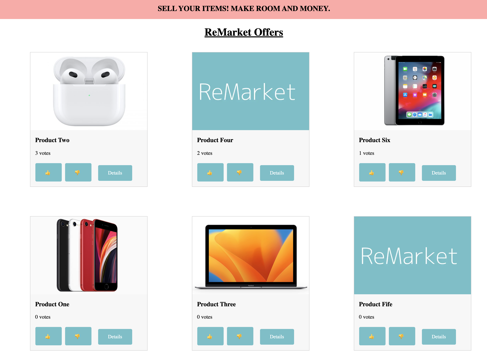

# Homeday Tech Task

## Table of contents

- [About the project](#about)
- [Getting started](#started)
- [Enhancements](#enhancements)

## About the project <a name="about"></a>

Hello and welcome to my solution to the Rebuy Frontend task that I was given on the recruitment process for the Frontend Engineer position.

## The task

reBuy wants to offer a merchant marketplace where customer can see, rate and buy offers. As a
developer at reBuy, you have a lot of freedom but need to take decisions with your team on how to
build the product. In this theoretical scenario (we do not want to implement this in reality), your task is
to tell us what solutions you would work with to create the frontend to fulfill the MVP requirements
(frameworks/principles/structure). The more detail the better. The requirements for the minimal viable
product would be:

<ul>
<li> a visitor can see a list of all offers ordered by votes
<li> a visitor can see details of a specific offer
<li> a user can up/downvote the offers
<li> a user can purchase an offer using our existing platform
<li> we want to enter the market as soon as possible. Therefore, we aim to have a minimal
product and only support desktop users
</ul>

Please note that over the time of the scenario we will build up upon your imaginary stack

### Demo

This is the overview of the offers available. You can see more details if you click the "Details" button.


### Technology, Methodology, and Layout

I decided to use Vue for this MVP because it doesn't add unnecessary baggage and it's the fastest way for me to work. In addition, I used Scss as a preprocessor.
In the project I followed several design principles and structures, I'll explain more in my presentation.

## Getting started <a name="started"></a>

### Prerequisites

You need to install npm on your machine.

```
$ npm install npm@latest -g
```

### Installation

To try the app on your machine, you need to clone this repo.

```
git clone https://github.com/DerProfi/Rebuy
```

## Enhancements <a name="enhancements"></a>

## Testing

The next step will be unit tests, which I would like to link to the various components. Since I did not have the time for this, they are not yet available.

## Modularity

Since I have used modularity of components as an example here for illustrative purposes, there are still enough possibilities to go deeper into modularity.

## Add offers

The next functional addition is the possibility to add new offers with the corresponding details to the project.
